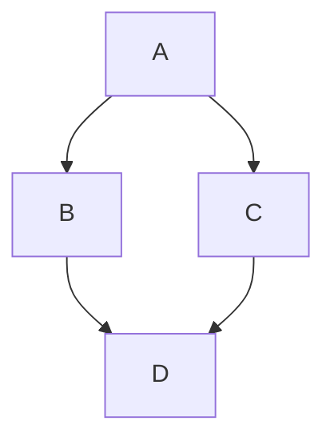

# Biwa Press (日本語)

SvelteKit、Tailwind CSS 4、Bits UI、mdsvex、および柔軟なレンダリングモードを備えた、VitePress にインスパイアされたドキュメントフレームワークのスターターテンプレートです。

## 特徴

- ⚡️ **Svelte 5 & SvelteKit**: モダンでリアクティブ、かつ高速。
- 🎨 **Tailwind CSS 4**: 最新のユーティリティファースト CSS フレームワーク。
- 📝 **mdsvex**: Markdown 内で Svelte コンポーネントを使用可能。
- 🔍 **組み込み検索**: 高速なクライアントサイド検索機能。
- 🌐 **多言語対応**: i18n サポートを内蔵（英語、中国語、日本語）。
- 🛠️ **柔軟なレンダリング**: SSG、SSR、CSR モードをサポート。

## 開発

```bash
npm install
npm run dev
```

## ビルドとデプロイ

Biwa Press は環境変数を通じて複数のレンダリングモードをサポートしています。

### 1. SSG (静的サイト生成) - 推奨
`build/ssg/` ディレクトリに完全な静的サイトを生成します。GitHub Pages や Vercel へのデプロイに最適です。
```bash
npm run build:ssg
npm run preview:ssg
npm run package:ssg
```

### 2. SSR (サーバーサイドレンダリング)
`build/ssr/` ディレクトリに Node.js サーバーを構築します。動的なサーバーロジックが必要な場合に使用します。
```bash
npm run build:ssr
npm run preview:ssr
npm run package:ssr
```

### 3. CSR (クライアントサイドレンダリング / SPA)
`build/csr/` ディレクトリに `index.html` フォールバックを備えたシングルページアプリケーション（SPA）を生成します。
```bash
npm run build:csr
npm run preview:csr
npm run package:csr
```

### ドキュメントキャッシュの更新

Biwa Press は、本番環境（SSR）でサイドバー構造と検索インデックスをキャッシュし、最高の応答速度を確保しています。VPS 上で SFTP などを使用して Markdown ファイルを更新した場合、Node.js プロセスを再起動することなく、以下の `curl` コマンドで強制的にキャッシュをクリアできます。

```bash
# <YOUR_TOKEN> を環境変数 REVALIDATE_TOKEN の値に置き換えてください。
# <YOUR_DOMAIN> を実際のドメインまたは IP に置き換えてください (例: your-domain.com または 192.168.1.100:3000)。
curl -X POST \
     -H "Authorization: Bearer <YOUR_TOKEN>" \
     https://<YOUR_DOMAIN>/api/refresh-cache
```

#### 設定に関する注意
1. **セキュリティ**：この API は `REVALIDATE_TOKEN` によって保護されています。VPS の環境変数（例: `.env` ファイル、pm2 設定ファイル、またはシステム環境変数）に強力なパスワードを設定してください。
2. **ローカルテスト**：
   ```bash
   curl -X POST -H "Authorization: Bearer your-secret-token" http://localhost:5173/api/refresh-cache
   ```
3. **適用範囲**：この操作により、サイドバーのディレクトリツリーが再スキャンされ、検索インデックスが再構築されます。

## Markdown 拡張

Biwa Press は、リッチなドキュメントページを構築するためのカスタム Markdown 拡張機能を提供しています。

### 1. ボタン (Button)
リンクを強調されたスタイルのボタンとしてレンダリングします。
```markdown
:::button
[旅を始める](/ja/docs/guide/getting-started)
:::
```

### 2. カード (Card)
コンテンツのコンテナを作成します。オプションのタイトルや内部リンクをサポートしています。
```markdown
:::card プロジェクトの目標 [/ja/docs/guide/getting-started]
- 高速なレンダリング
- Markdown 優先
:::

:::card タイトルなし
シンプルなカードコンテンツ。
:::
```

### 3. タブ (Tabs)
コンテンツを切替可能なタブに整理します。`==` を使用して新しいタブを定義します。
```markdown
:::tabs
== Shell
```bash
npm run dev
```
== Package.json
```json
{ "name": "biwa-press" }
```
:::
```

### 4. ギャラリー (Gallery - グリッドレイアウト)
画像やカードをレスポンシブなグリッド（デスクトップでは通常 3 列）で表示します。
```markdown
:::gallery
- 
- 

:::card 嵌套カード
ギャラリーの中にカードを入れ子にすることも可能です！
:::
:::
```

### 5. タイムライン (Timeline)
垂直方向のイベントタイムラインを表示します。
```markdown
:::timeline
- **2024/05/15**
  - Biwa Press v0.1.0 リリース。
- **2024/01/01**
  - プロジェクト開始。
:::
```

### 6. 折りたたみ (Details)
ネイティブの HTML `<details>` タグを使用した、切替可能なコンテナです。
```markdown
:::details コードスニペットを表示
```typescript
console.log("Hello Biwa!");
```
:::
```

### 7. GitHub 埋め込み (GitHub Embed)
GitHub リポジトリへのクイックリンクや Gist の埋め込み。
```markdown
::github[markedjs/marked]
::github[gist:YOUR_GIST_ID]
```

### 8. ビデオ (Videos)
遅延読み込みとアスペクト比制御を備えた拡張ビデオ埋め込み。

**構文:** `::タイプタイトル{width=...}{ratio=...}{poster=...}{lazy}`

*   **ローカル:** `::videoデモビデオ{width=300}{ratio=9:16}{poster=/videos/1.png}{lazy}`
*   **YouTube:** `::youtubeビデオタイトル{ratio=16:9}{lazy}`
*   **Bilibili:** `::bilibiliビデオタイトル{ratio=16:9}{lazy}`

**属性:**
*   `{width=...}`: 最大幅（ピクセル）。
*   `{ratio=...}`: アスペクト比（例：`16:9`）。
*   `{poster=...}`: サムネイル画像（ローカルビデオに推奨）。
*   `{lazy}`: 表示された時のみ読み込みと（ミュート状態での）自動再生を行います。

### 9. 画像とライトボックス (Images & Lightbox)
標準の Markdown 画像は、内蔵の「ライトボックス」機能を自動的にサポートします。画像をクリックするとフルスクリーンオーバーレイで表示されます。

```markdown

```

### 10. Mermaid ダイアグラム (Mermaid Diagrams)
Mermaid.js を使用してチャートや図をレンダリングします。


```

## PM2 本番環境でのデプロイと管理

本プロジェクトでは、本番環境において [PM2](https://pm2.keymetrics.io/) を使用したプロセス管理を推奨しています。これにより、サービスの安定稼働とサーバー再起動時の自動起動を実現できます。

### 1. PM2 をグローバルインストールする
VPS 上で以下のコマンドを実行して PM2 をインストールします。

```bash
sudo npm install pm2 -g
```

### 2. よく使う管理コマンド
以下の操作は、`ecosystem.config.js` を含むプロジェクトのルートディレクトリで実行してください。

| 操作 | コマンド | 説明 |
| :--- | :--- | :--- |
| **アプリケーション起動** | `pm2 start ecosystem.config.cjs` | 設定ファイルに基づいてアプリを起動（初回デプロイ時） |
| **アプリケーション停止** | `pm2 stop <name\|id>` | プロセスを停止するが、PM2 の管理リストには保持 |
| **アプリケーション再起動** | `pm2 restart <name\|id>` | プロセスを強制終了して再起動 |
| **グレースフルリロード** | `pm2 reload <name\|id>` | ダウンタイムなしで再読み込み（本番更新時に推奨） |
| **状態確認** | `pm2 status` または `pm2 list` | CPU・メモリ使用状況および実行状態を確認 |
| **ログ確認** | `pm2 logs <name\|id>` | リアルタイムログを表示（トラブルシューティング時に必須） |
| **アプリ削除** | `pm2 delete <name\|id>` | アプリを停止し、PM2 管理リストから完全削除 |

### 3. 設定の永続化（サーバー起動時の自動起動）
VPS 再起動後も `biwa-press` が自動的に復旧するよう、以下のコマンドを順番に実行してください。

1. **現在の状態を保存**
```bash
pm2 save
```

2. **自動起動設定を有効化**
```bash
pm2 startup
```

*このコマンドを実行すると、ターミナルに `sudo` で始まるコマンドが表示されます。そのコマンドをコピーして実行することで設定が完了します。*

### 4. 環境変数の更新
`ecosystem.config.js` 内の `ORIGIN` や `PORT` などの環境変数を変更した場合は、以下のコマンドを実行して反映させてください。

```bash
pm2 restart <name|id> --update-env
```

環境変数（例: `REVALIDATE_TOKEN`）が正しく読み込まれているか確認するには、以下を使用します。

```bash
pm2 env <id> | grep REVALIDATE_TOKEN
```
