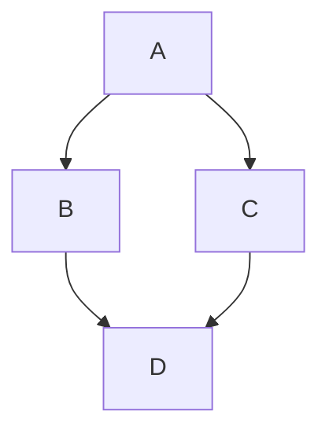

# Biwa Press

A VitePress-like documentation framework starter powered by SvelteKit, Tailwind CSS 4, Bits UI, mdsvex, and static generation.

## Features

- ⚡️ **Svelte 5 & SvelteKit**: Modern, reactive, and fast.
- 🎨 **Tailwind CSS 4**: The latest utility-first CSS framework.
- 📝 **mdsvex**: Write documentation using Markdown with Svelte components.
- 🔍 **Built-in Search**: Fast client-side search functionality.
- 🌐 **Multi-language Support**: Built-in i18n support (EN, ZH, JA).
- 🛠️ **Flexible Rendering**: Supports SSG, SSR, and CSR modes.

## Development

```bash
npm install
npm run dev
```

## Build and Deployment

Biwa Press supports multiple rendering modes via environment variables:

### 1. SSG (Static Site Generation) - Recommended
Generates a full static site in the `build/ssg/` directory. Perfect for deployment on GitHub Pages, Netlify, or Vercel.
```bash
npm run build:ssg
npm run preview:ssg
npm run package:ssg
```

### 2. SSR (Server-Side Rendering)
Builds a Node.js server application in the `build/ssr/` directory. Use this mode if you need dynamic server-side logic.
```bash
npm run build:ssr
npm run preview:ssr
npm run package:ssr
```

### 3. CSR (Client-Side Rendering / SPA)
Generates a Single Page Application (SPA) in the `build/csr/` directory with an `index.html` fallback.
```bash
npm run build:csr
npm run preview:csr
npm run package:csr
```

### Refreshing Document Cache

Biwa Press caches sidebar structures and search indexes in production (SSR) mode for optimal response speed. If you update Markdown files on your VPS via SFTP or other means, you can force a cache refresh using the following `curl` command without restarting the Node.js process:

```bash
# Replace <YOUR_TOKEN> with the value of your REVALIDATE_TOKEN environment variable.
# Replace <YOUR_DOMAIN> with your actual domain or IP (e.g., your-domain.com or 192.168.1.100:3000).
curl -X POST \
     -H "Authorization: Bearer <YOUR_TOKEN>" \
     https://<YOUR_DOMAIN>/api/refresh-cache
```

#### Configuration Notes
1. **Security**: This API is protected by `REVALIDATE_TOKEN`. Ensure you set a strong password for this environment variable on your VPS (e.g., in a `.env` file, pm2 configuration, or system environment variables).
2. **Local Testing**:
   ```bash
   curl -X POST -H "Authorization: Bearer your-secret-token" http://localhost:5173/api/refresh-cache
   ```
3. **Scope**: This operation will re-scan the document directories to update the sidebar (Sidebar) directory tree and rebuild the search index (Search Index).

## Markdown Extensions

Biwa Press provides a set of custom Markdown extensions to help you build rich documentation pages.

### 1. Button
Render a link as a prominent styled button.
```markdown
:::button
[Start Journey](/en/docs/guide/getting-started)
:::
```

### 2. Card
Create a container for content. Supports optional titles and internal links.
```markdown
:::card Project Goals [/en/docs/guide/getting-started]
- Fast Rendering
- Markdown First
:::

:::card No Title
Plain card content.
:::
```

### 3. Tabs
Organize content into switchable tabs. Use `==` to define a new tab.
```markdown
:::tabs
== Shell
```bash
npm run dev
```
== Package.json
```json
{ "name": "biwa-press" }
```
:::
```

### 4. Gallery (Grid Layout)
Render images or cards in a responsive grid (usually 3 columns on desktop).
```markdown
:::gallery
- 
- 

:::card Nested Card
You can even nest cards inside a gallery!
:::
:::
```

### 5. Timeline
Display a vertical timeline of events.
```markdown
:::timeline
- **2024/05/15**
  - Biwa Press v0.1.0 released.
- **2024/01/01**
  - Project started.
:::
```

### 6. Details (Collapse)
A toggleable container using native HTML `<details>`.
```markdown
:::details View Code Snippet
```typescript
console.log("Hello Biwa!");
```
:::
```

### 7. GitHub Embed
Quickly link to a GitHub repository or embed a Gist.
```markdown
::github[markedjs/marked]
::github[gist:YOUR_GIST_ID]
```

### 8. Videos
Enhanced video embedding with lazy loading and ratio control.

**Syntax:** `::typetitle{width=...}{ratio=...}{poster=...}{lazy}`

*   **Local:** `::videoDemo{width=300}{ratio=9:16}{poster=/videos/1.png}{lazy}`
*   **YouTube:** `::youtubeTitle{ratio=16:9}{lazy}`
*   **Bilibili:** `::bilibiliTitle{ratio=16:9}{lazy}`

**Attributes:**
*   `{width=...}`: Max width in pixels.
*   `{ratio=...}`: Aspect ratio (e.g., `16:9`).
*   `{poster=...}`: Thumbnail image (recommended for local videos).
*   `{lazy}`: Load and autoplay (muted) only when visible.

### 9. Images & Lightbox
Standard Markdown images are automatically supported with a built-in "Lightbox" feature. Click any image to view it in full-screen overlay.

```markdown

```

### 10. Mermaid Diagrams
Render charts and diagrams using Mermaid.js.


```

## PM2 Deployment and Management for Production

For production environments, this project recommends using [PM2](https://pm2.keymetrics.io/) for process management to ensure service stability and automatic startup after system reboot.

### 1. Install PM2 Globally
Run the following command on your VPS to install PM2:
```bash
sudo npm install pm2 -g
```

### 2. Common Management Commands
Make sure to execute the following commands in the project root directory (the directory containing `ecosystem.config.js`).

| Action | Command | Description |
| :--- | :--- | :--- |
| **Start Application** | `pm2 start ecosystem.config.cjs` | Start the application using the configuration file (first deployment) |
| **Stop Application** | `pm2 stop <name\|id>` | Stop the process while keeping it in the PM2 process list |
| **Restart Application** | `pm2 restart <name\|id>` | Forcefully terminate and restart the process |
| **Graceful Reload** | `pm2 reload <name\|id>` | Zero-downtime reload (recommended for production updates) |
| **Check Status** | `pm2 status` or `pm2 list` | View CPU usage, memory consumption, and process status |
| **View Logs** | `pm2 logs <name\|id>` | View real-time logs (essential for debugging) |
| **Delete Application** | `pm2 delete <name\|id>` | Stop and completely remove the application from PM2 |

### 3. Persist Configuration (Auto Start on Boot)
To ensure `biwa-press` automatically restarts after a VPS reboot, execute the following commands in order:

1. **Save Current Process List**
```bash
pm2 save
```

2. **Enable Startup Script**
```bash
pm2 startup
```

*After running this command, the terminal will output another command beginning with `sudo`. Copy and execute that command to complete the setup.*

### 4. Updating Environment Variables
If you modify environment variables such as `ORIGIN` or `PORT` in `ecosystem.config.js`, run the following command to apply the changes:
```bash
pm2 restart <name|id> --update-env
```

To verify that environment variables (such as `REVALIDATE_TOKEN`) have been loaded correctly, use:
```bash
pm2 env <id> | grep REVALIDATE_TOKEN
```
