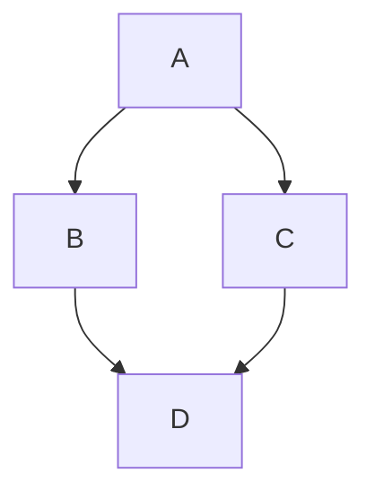

# Biwa Press (中文)

一个受 VitePress 启发的文档框架起手模板，基于 SvelteKit、Tailwind CSS 4、Bits UI、mdsvex 以及灵活的渲染模式。

## 特性

- ⚡️ **Svelte 5 & SvelteKit**: 现代、响应式且高效。
- 🎨 **Tailwind CSS 4**: 最新的实用优先 CSS 框架。
- 📝 **mdsvex**: 在 Markdown 中直接使用 Svelte 组件。
- 🔍 **内置搜索**: 高效的客户端搜索功能。
- 🌐 **多语言支持**: 内置国际化支持（中、英、日）。
- 🛠️ **灵活渲染**: 完美支持 SSG、SSR 和 CSR 模式。

## 开发环境

```bash
npm install
npm run dev
```

## 构建与部署

Biwa Press 通过环境变量支持多种渲染模式：

### 1. SSG (静态网站生成) - 推荐
在 `build/ssg/` 目录下生成完整的静态文件。非常适合部署在 GitHub Pages、Netlify 或 Vercel。
```bash
npm run build:ssg
npm run preview:ssg
npm run package:ssg
```

### 2. SSR (服务端渲染)
在 `build/ssr/` 目录下构建一个 Node.js 服务端应用。如果你需要动态的服务端逻辑，请使用此模式。
```bash
npm run build:ssr
npm run preview:ssr
npm run package:ssr
```

### 3. CSR (客户端渲染 / SPA)
在 `build/csr/` 目录下生成一个带有 `index.html` 回退机制的单页应用。
```bash
npm run build:csr
npm run preview:csr
npm run package:csr
```

### 刷新文档缓存

Biwa Press 在生产模式下（SSR）会缓存侧边栏结构和搜索索引以确保极致的响应速度。如果你通过 SFTP 或其他方式在 VPS 上更新了 Markdown 文件，可以通过以下 `curl` 命令强制刷新缓存，而无需重启 Node.js 进程：

```bash
# 请将 <YOUR_TOKEN> 替换为环境变量 REVALIDATE_TOKEN 的值
# 将 <YOUR_DOMAIN> 替换为你的实际域名或 IP (例如：your-domain.com 或 192.168.1.100:3000)
curl -X POST \
     -H "Authorization: Bearer <YOUR_TOKEN>" \
     https://<YOUR_DOMAIN>/api/refresh-cache
```

#### 配置说明
1. **安全性**：该接口受 `REVALIDATE_TOKEN` 保护。请确保在 VPS 的环境变量（如 `.env` 文件、pm2 配置文件或系统环境变量）中设置了一个强密码。
2. **本地测试**：
   ```bash
   curl -X POST -H "Authorization: Bearer your-secret-token" http://localhost:5173/api/refresh-cache
   ```
3. **生效范围**：此操作将重新扫描文档目录以更新侧边栏（Sidebar）目录树，并重新构建搜索索引（Search Index）。

## Markdown 扩展

Biwa Press 提供了一系列自定义 Markdown 扩展，帮助你构建丰富的文档页面。

### 1. 按钮 (Button)
将链接渲染为突出样式的按钮。
```markdown
:::button
[开始旅程](/zh/docs/guide/getting-started)
:::
```

### 2. 卡片 (Card)
创建内容容器。支持可选标题和内部链接。
```markdown
:::card 项目目标 [/zh/docs/guide/getting-started]
- 快速渲染
- Markdown 优先
:::

:::card 无标题
纯卡片内容。
:::
```

### 3. 标签页 (Tabs)
将内容组织成可切换的标签页。使用 `==` 定义新标签页。
```markdown
:::tabs
== Shell
```bash
npm run dev
```
== Package.json
```json
{ "name": "biwa-press" }
```
:::
```

### 4. 画廊 (Gallery - 网格布局)
以响应式网格（桌面端通常为 3 列）渲染图片或卡片。
```markdown
:::gallery
- 
- 

:::card 嵌套卡片
你甚至可以在画廊中嵌套卡片！
:::
:::
```

### 5. 时间线 (Timeline)
显示垂直事件时间线。
```markdown
:::timeline
- **2024/05/15**
  - Biwa Press v0.1.0 发布。
- **2024/01/01**
  - 项目启动。
:::
```

### 6. 详情 (Details - 折叠)
使用原生 HTML `<details>` 标签的可切换容器。
```markdown
:::details 查看代码片段
```typescript
console.log("Hello Biwa!");
```
:::
```

### 7. GitHub 嵌入 (GitHub Embed)
快速链接到 GitHub 仓库或嵌入 Gist。
```markdown
::github[markedjs/marked]
::github[gist:YOUR_GIST_ID]
```

### 8. 视频 (Videos)
增强的视频嵌入功能，支持懒加载和比例控制。

**语法:** `::类型标题{width=...}{ratio=...}{poster=...}{lazy}`

*   **本地视频:** `::video演示视频{width=300}{ratio=9:16}{poster=/videos/1.png}{lazy}`
*   **YouTube:** `::youtube视频标题{ratio=16:9}{lazy}`
*   **Bilibili:** `::bilibili视频标题{ratio=16:9}{lazy}`

**属性:**
*   `{width=...}`: 最大宽度（像素）。
*   `{ratio=...}`: 宽高比（例如 `16:9`）。
*   `{poster=...}`: 封面图（强烈建议本地视频使用）。
*   `{lazy}`: 仅在可见时加载并自动静音播放。

### 9. 图片与灯箱 (Images & Lightbox)
标准 Markdown 图片自动支持内置的“灯箱”功能。点击任意图片可在全屏叠加层中查看。

```markdown

```

### 10. Mermaid 图表 (Mermaid Diagrams)
使用 Mermaid.js 渲染图表。


```

## PM2 生产环境部署与管理

本项目在生产环境下建议使用 [PM2](https://pm2.keymetrics.io/) 进行进程管理，以确保服务的稳定性和开机自启。

### 1. 全局安装 PM2
在 VPS 上执行以下命令进行安装：
```bash
sudo npm install pm2 -g
```

### 2. 常用管理命令
请确保在项目根目录（包含 ecosystem.config.js 的目录）下执行以下操作：

| 操作 | 命令 | 说明 |
| :--- | :--- | :--- |
| **启动应用** | `pm2 start ecosystem.config.cjs` | 根据配置文件启动应用（首次部署） |
| **停止应用** | `pm2 stop <name|id>` | 停止运行，但保留在进程列表中 |
| **重启应用** | `pm2 restart <name|id>` | 强制杀掉并重启进程 |
| **平滑重载** | `pm2 reload <name|id>` | 零停机重载（推荐用于生产环境更新） |
| **查看状态** | `pm2 status` 或 `pm2 list` | 查看应用 CPU、内存占用及运行状态 |
| **查看日志** | `pm2 logs <name|id>` | 查看实时输出日志（排查错误必用） |
| **删除应用** | `pm2 delete <name|id>` | 停止并从管理列表中彻底移除 |

### 3. 持久化配置（开机自启）
为了保证 VPS 重启后 biwa-press 能自动恢复运行，请依次执行：

1. **保存状态**：将当前运行的进程列表保存。
```bash
pm2 save
```
2. **设置开机启动**：
```bash
pm2 startup
```
*执行此命令后，终端会返回一行以 `sudo` 开头的指令，请复制并执行该指令以完成配置。*

### 4. 环境变量更新
如果你修改了 ecosystem.config.js 中的 ORIGIN 或 PORT 等环境变量，需要执行以下命令生效：
```bash
pm2 restart <name|id> --update-env
```

要验证环境变量（如 `REVALIDATE_TOKEN`）是否已正确加载，请使用：
```bash
pm2 env <id> | grep REVALIDATE_TOKEN
```
