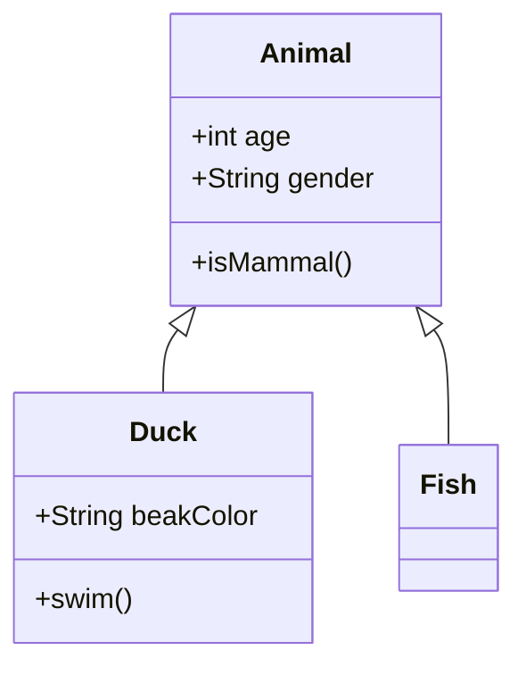
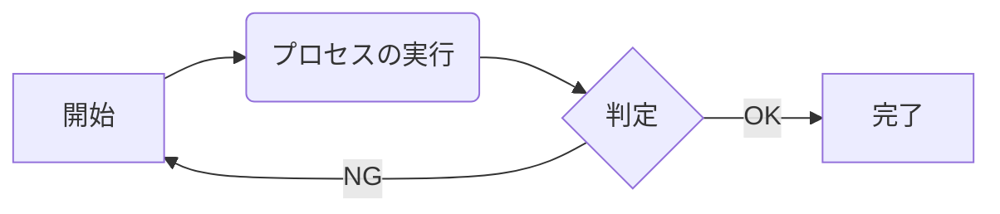

## UML

```mermaid
classDiagram
    Animal <|-- Duck
    Animal <|-- Fish
    Animal : +int age
    Animal : +String gender
    Animal: +isMammal()
    class Duck{
        +String beakColor
        +swim()
    }
```

## Flowchat

```mermaid
flowchart LR
    A[開始] --> B(プロセスの実行)
    B --> C{判定}
    C -->|OK| D[完了]
    C -->|NG| A
```

